# autonomous-space-grasping
Autonomous neural network for inferring optimal robotic grasping points on space components using 3D meshes.

## 1. Cálculo del Ground Truth
Para que el modelo aprenda a identificar buenos agarres, primero es necesario enseñarle qué constituye un "agarre perfecto". En lugar de anotar los datos manualmente, se ha desarrollado un pipeline determinista (s1_gt_raycasting.py) que evalúa las mallas 3D y asigna una puntuación de viabilidad a cada punto de su superficie.

Este proceso se divide en las siguientes etapas clave:

#### 1. Muestreo Superficial y Centrado Dinámico
PointNet necesita una entrada uniforme. Utilizando la librería trimesh, se realiza un muestreo de la superficie de la malla para extraer exactamente 8192 puntos junto con sus vectores normales.  Para garantizar la invariancia a la traslación (crucial en modelos como PointNet), se calcula el centroide de la nube de puntos. Las coordenadas de todos los puntos se desplazan restando este centroide, situando el origen de coordenadas (0,0,0) en el centro de la pieza. Se realiza en memoria, evitando sobrecargar el disco.

#### 2. Evaluación Gravitacional
En la manipulación de componentes satelitales en órbita o en un entorno de microgravedad, agarrar un objeto lejos de su centro de masas genera torques que desestabilizan el control del brazo robótico. 
Se calcula la distancia euclídea de cada punto al CoM.  Se normalizan estas distancias: los puntos más cercanos al CoM reciben una puntuación 1.0, mientras que los más alejados de 0.0.

#### 3. Evaluación Geométrica Local mediante PCA
Para garantizar que el efector final tengan una superficie de contacto estable, es necesario analizar la topología de la pieza. Se construye unKDTree para identificar rápidamente los puntos vecinos dentro de un radio de 2.5cm. 
Para cada vecindad, se calcula su matriz de covarianza y se extraen sus autovalores (eigenvalues: $\lambda_1, \lambda_2, \lambda_3$) mediante Análisis de Componentes Principales (PCA).  
Estos autovalores determinan la linealidad, planaridad y esfericidad de la región. Premiamos las superficies redondas o cóncavas frente a superficies planas.  Además, con el producto escalar entre la normal del punto y el vector hacia el centro, se premian los agarres concavos (más estables).

#### 4. Evaluación de Agarre ( observando las normales)
Se evalúa la orientación de la superficie respecto al centro del objeto. Se calcula el producto escalar entre el vectore de dirección desde el punto al centro de masas y las normales de la superficie.  Un valor absoluto cercano a 1 indica que la superficie es perpendicular al vector radial, lo que suele ofrecer agarres más firmes frente al deslizamiento.

#### 5. Raycasting
De nada sirve una superficie plana cerca del centro de masas si la pieza en esa zona es más ancha que la apertura máxima de la pinza.
Se generan rayos virtuales que parten desde cada punto de la superficie.  Para evitar auto-colisiones numéricas ("chocar contra la propia piel"), el origen del rayo se desplaza ligeramente.  Se dispara un rayo en la dirección opuesta a la normal (hacia adentro) y otro en la dirección de la normal (hacia afuera).  La intersección válida más cercana con otra cara de la malla determina el grosor de la pieza en ese punto exacto.  Si el grosor calculado supera los 10cm, la viabilidad geométrica de ese punto se multiplica por 0.

#### 6. Normalización a Esfera Unitaria
Se calcula la distancia máxima desde el origen y se dividen todas las coordenadas por este radio. Esto encoge todo el objeto para que encaje dentro de una esfera de radio 1.0, un requisito crítico para la estabilidad de los gradientes y la convergencia de la red neuronal.

## 2. Arquitectura del Modelo (PointNetGrasping Modificado)
El núcleo del sistema es una red neuronal basada en la arquitectura PointNet (s4_model.py). El modelo original fue diseñado para clasificación, pero en este proyecto se ha modificado para actuar como un regresor de viabilidad punto a punto usando espacios latentes.  

El Encoder: Procesa los datos de entrada (coordenadas espaciales y vectores normales) mediante Perceptrones Multicapa compartidos.

Se aplica una operación de Max Pooling para extraer la característica más destacada de cada dimensión.

Invariancia al Orden: Esto genera un vector latente (de tamaño 1024) que describe el objeto, independientemente del orden en el que se hayan introducido los puntos de la nube.

El Decoder: A diferencia de un Autoencoder clásico que intentaría reconstruir la geometría original del satélite, nuestra variante tiene otro objetivo:

1. El vector latente global se replica y se concatena con la información local (la geometría original) de cada uno de los 8192 puntos.

2. Capa Sigmoide: La red aplica una función de activación final Sigmoide para acotar la salida predictiva estrictamente al rango (0-1).

De esta forma, el modelo aprende las características geométricas relevantes para el agarre, reduciendo la necesidad de procesamiento pesado en órbita.  

Cada punto se evalúa teniendo en cuenta tanto su forma como el contexto global de la pieza

## 3. Resultado de la Inferencia
En esta etapa (script s7_inference.py), simulamos lo que captaría la cámara 3D del robot ante una componente espacial averiada o desconocida.

1. Se introduce una malla 3D completamente nueva
2. Se extraen 8192 puntos y normales, centrando y normalizando la nube (muy importante para que la red interprete correctamente la escala aprendida).
3. El modelo procesa la nube de puntos y devuelve un array con 8192 valores (entre 0.0 y 1.0).
4. Se guarda como un atributo "Quality" en un archivo .ply.

Esto permite visualizar la nube de puntos en un programa (como MeshLab) mediante un mapa de calor.

Las zonas con valores cercanos a 1.0 (colores rojos) indicarán las superficies óptimas y viables para el robot

Los valores térmicos 4D no interfieren en la predicción de la forma geométrica, sino que actúan como un filtro de post-procesado para descartar zonas geométricamente buenas pero que superen los umbrales de temperatura.

## 4. Cálculo de la Pose de agarre

#### 1. Filtrado

Partimos de una nube de puntos que la red neuronal ya ha putuado (0-1) la calidad del agarre en esa zona

Aplicamos un umbral estricto para asegurar elegir una buena zona y para reducir mucho el cálculo que hay que realizar

#### 2. Clustering

Una vez filtrados los puntos, se suelen quedar agrupados sobre la superficie de la pieza. Para identificar estos grupos, usamos DBSCAN (Agrupamiento Espacial Basado en Densidad con Ruido).

El algoritmo busca zonas densas de puntos y descarta aquellos puntos buenos que estén aislados (ruido), asegurando que haya una superficie lo suficientemente amplia para los dedos.

#### 3. Selección del Objetivo y Cálculo del Centroide

Con los clústeres ya identificados, calculamos la nota media de todos los puntos que componen cada grupo. El clúster con la puntuación media más alta se considera la mejor

Para darle al robot una coordenada exacta, calculamos el centro geométrico (la media de las coordenadas X, Y, Z) de este grupo ganador. Este será el punto hacia el que se dirigirá el efector final.

(por implementar) Si el centroide seleccionado pertenece a una zona que excede los umbrales de temperatura operativos del manipulador, el clúster se invalida y se pasa al siguiente mejor evaluado. La temperatura no modifica la predicción geométrica, actúa como un filtro.

#### 4. Generar la pose

Tener un punto (X, Y, Z) no es suficiente para un brazo de 7 grados de libertad como el Kinova Gen2. El robot necesita saber con qué inclinación y giro debe aproximarse (Roll, Pitch, Yaw) para no chocar con la pieza. Para ello, construimos un sistema de referencia local:

Eje Z: Calculamos la media de las normales del clúster ganador. Como queremos que la pinza "mire" hacia la pieza, invertimos este vector.

Eje Y: 
- si el producto escalar de Z y la gravedad no es paralelo: el eje y es paralelo al suelo
- en caso contrario (agarre desde arriba) utilizamos PCA para calcular el lado "más pequeño" y ese será nuestro eje y.

Eje X: Se calcula con el producto vectorial con los otros 2

## Ejemplos de GT

#### Ejemplo 1 (parte mecánica de una moto)

Este es el mesh de la figura:

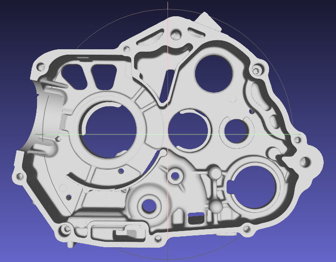

Este es el Ground Truth:

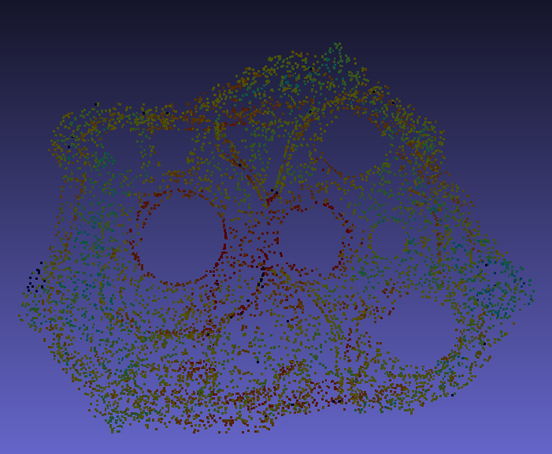

Esta es la inferencia de la red neuronal:

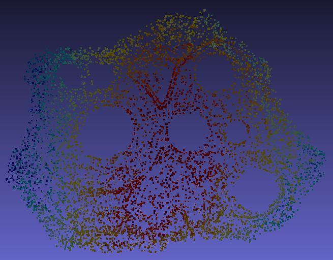

#### Ejemplo 2 (coche)

Este es el mesh de la figura:

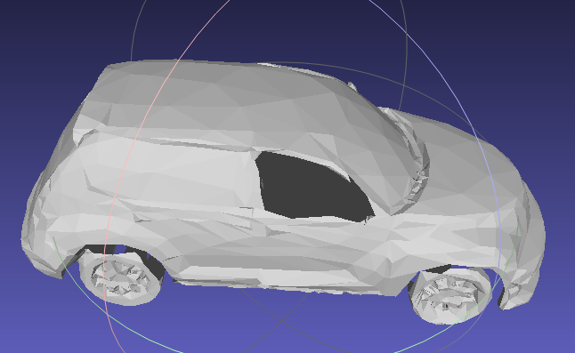

Este es el Ground Truth:

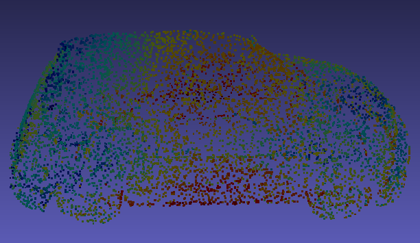

Esta es la inferencia de la red neuronal:

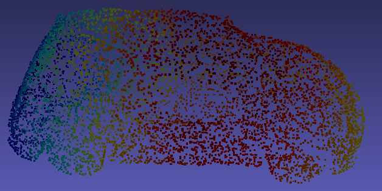

#### Ejemplo 3 (bote)

Este es el mesh de la figura:

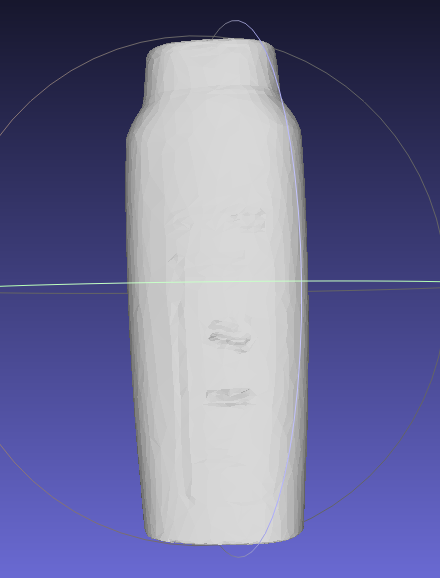

Este es el Ground Truth:

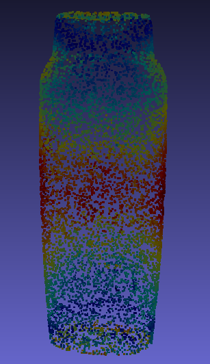

Esta es la inferencia de la red neuronal:

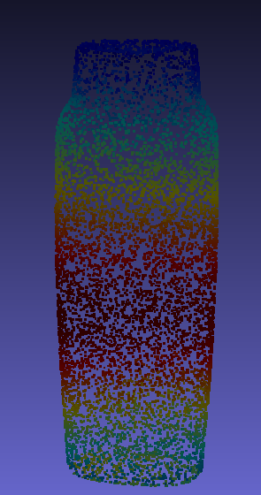

#### Información de los cálculos

- Tiempo en calcular los 3 Ground Truth: 627 segundos = más de 10 minutos

- Tiempo en calcular las 3 inferencias: 27 segundos

Esto se debe a que el cálculo del GT requiere hacer cálculos físicas y geométricas computacionalmente pesadas, incluyendo el cálculo de PCA y el cálculo de miles de intersecciones de rayos contra la malla  

Mientras que la inferencia neuronal es rapidísima porque PointNet ya ha aprendido los patrones y se limita a evaluar la nube de puntos mediante multiplicaciones matriciales (son paralelizadas y optimizadas en una sola pasada)

## Ejemplos de cálculo de coordenadas de agarre

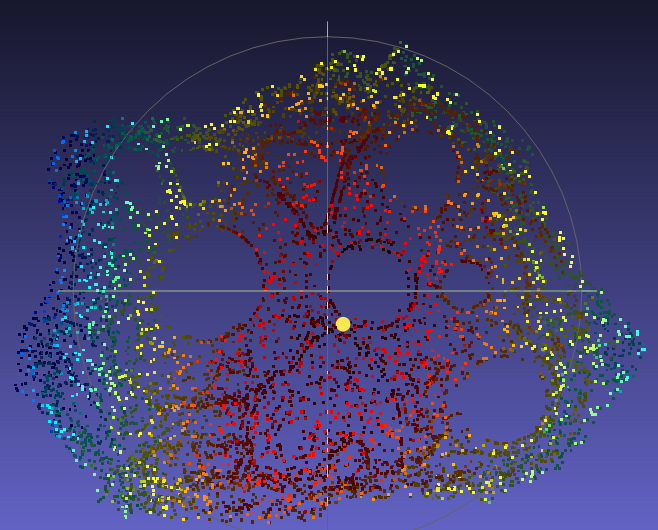

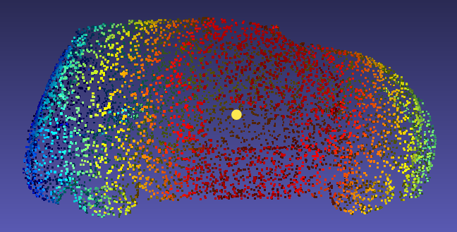

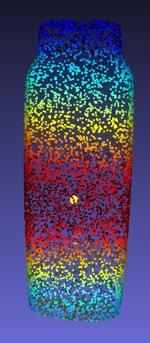
